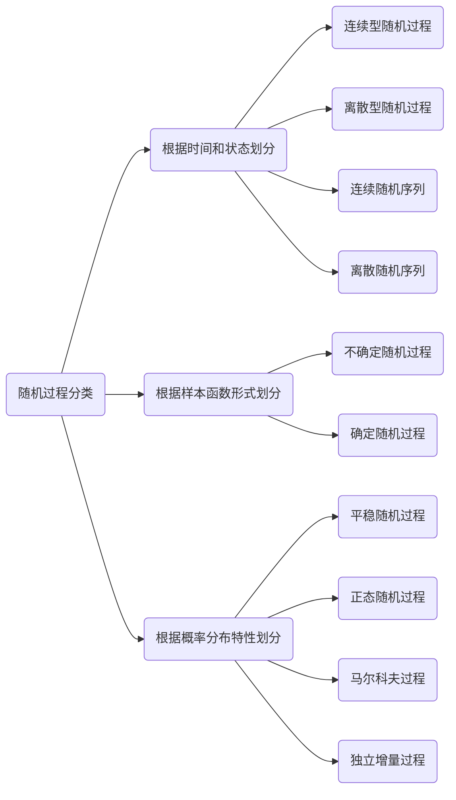

# Markdown 文档展示示例

这是一个 Markdown 文档展示的示例页面。你可以通过 `/demo.md` 或 `/docs/demo.md` 访问此页面。

## 功能特性

- 支持标准 Markdown 语法
- 支持 GFM（GitHub Flavored Markdown）扩展
- 美观的排版样式
- 响应式设计，支持移动端
- 支持代码高亮
- 支持表格、任务列表等

## 标题层级

### 三级标题

#### 四级标题

##### 五级标题

## 文本样式

这是一段普通文本。**这是粗体文本**，*这是斜体文本*，~~这是删除线文本~~。

> 这是一段引用文本。引用可以用来强调重要信息或者引述他人的话语。

## 列表

### 无序列表

- 第一项
- 第二项
  - 嵌套项 A
  - 嵌套项 B
- 第三项

### 有序列表

1. 第一步
2. 第二步
3. 第三步

### 任务列表

- [x] 已完成的任务
- [x] 另一个已完成的任务
- [ ] 待完成的任务
- [ ] 另一个待完成的任务

## 代码

### 行内代码

使用 `const` 关键字声明常量，使用 `let` 声明变量。

`he data in this module is over two months old.  To ensure accurate Baseline data, please update`

### 代码块

```javascript
// JavaScript 示例
function greet(name) {
  console.log(`Hello, ${name}!`);
}

greet('World');
```

```python
# Python 示例
def greet(name):
    print(f"Hello, {name}!")

greet("World")
```

```css
/* CSS 示例 */
.container {
  display: flex;
  justify-content: center;
  align-items: center;
  min-height: 100vh;
}
```

## 表格

| 功能 | 描述 | 状态 |
|------|------|------|
| Markdown 解析 | 支持标准 Markdown 语法 | ✅ 已完成 |
| GFM 扩展 | 支持表格、任务列表等 | ✅ 已完成 |
| 代码高亮 | 支持多种编程语言 | ✅ 已完成 |
| 响应式布局 | 适配移动端显示 | ✅ 已完成 |

## 链接

- [访问首页](/)
- [GitHub](https://github.com)
- [Google](https://google.com)

## 图片


## 分隔线


## 数学公式（如果安装了相关插件）

行内公式：$E = mc^2$

块级公式：

$$
\frac{n!}{k!(n-k)!} = \binom{n}{k}
$$

## HTML 支持

<details>
<summary>点击展开更多内容</summary>

这是折叠的内容，可以包含任何 Markdown 语法：

- 列表项 1
- 列表项 2

```js
console.log('Hello from collapsed content!');
```

</details>

<div style="padding: 16px; background: linear-gradient(135deg, #667eea 0%, #764ba2 100%); border-radius: 8px; color: white; margin: 16px 0;">
  <strong>提示：</strong> 这是一个自定义样式的提示框，使用 HTML 实现。
</div>

## 脚注

这是一个带有脚注的段落[^1]。

[^1]: 这是脚注的内容。


## 总结

Markdown 是一种轻量级标记语言，它允许人们使用易读易写的纯文本格式编写文档。通过本页面，你可以看到各种 Markdown 元素的渲染效果。

如需了解更多 Markdown 语法，请参考 [Markdown 官方文档](https://www.markdownguide.org/)。

## 新测试





<span class="blur-content">模糊内容（鼠标悬停显示）</span>