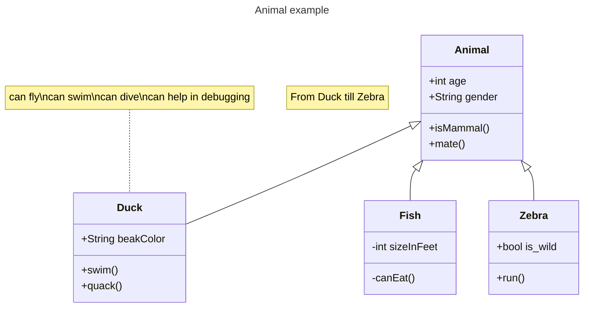

# 快速入门指南

欢迎使用 Xs-Blog！本指南将帮助你快速了解系统的基本功能和使用方法。

## 目录

- [系统概述](#系统概述)
- [功能模块](#功能模块)
- [常用操作](#常用操作)
- [常见问题](#常见问题)

## 系统概述

Xs-Blog 是一个现代化的个人博客系统，具有以下特点：

1. **轻量高效** - 基于 Next.js 和 Express 构建，性能优异
2. **美观简洁** - 精心设计的 UI，支持多种主题
3. **功能丰富** - 笔记、图库、导航、朋友圈等多种功能
4. **易于部署** - 支持多种部署方式

## 功能模块

### 笔记管理

笔记是博客的核心功能，支持：

- Markdown 编辑
- 图片上传
- 分类和标签
- 密码保护
- 网盘资源

### 图库管理

精美的图片展示：

- 多图册管理
- 瀑布流布局
- 图片预览
- 密码保护

### 网站导航

收藏和分享网站：

- 分类管理
- 图标上传
- 一键访问

## 常用操作

### 发布笔记

```bash
# 1. 登录后台管理
# 2. 进入笔记管理
# 3. 点击"新建笔记"
# 4. 编辑内容并保存
```

### 上传图片

支持的图片格式：

| 格式 | 说明 |
|------|------|
| JPG/JPEG | 常用照片格式 |
| PNG | 支持透明背景 |
| GIF | 支持动图 |
| WebP | 现代压缩格式 |

## 常见问题

<details>
<summary>Q: 如何修改网站标题？</summary>

进入后台管理 → 系统设置 → 修改"网站标题"即可。

</details>

<details>
<summary>Q: 如何上传自定义 Logo？</summary>

进入后台管理 → 系统设置 → 点击"上传 Logo"按钮。

</details>

<details>
<summary>Q: 如何修改主题颜色？</summary>

进入后台管理 → 系统设置 → 选择喜欢的主题颜色。

</details>

---


---
> **提示**：更多详细说明请查看完整的用户手册。

如有问题，欢迎提交 [Issue](https://github.com/su16888/Xs-blog/issues)。
