# Mermaid 图表写法指南（写法 + 格式 + 注意事项 + Demo）

本文是 Mermaid 的“可直接复制粘贴版”写法指南：每个图都包含**写法/格式说明**、**注意事项**、以及**完整 Demo 代码块**。

---

## 0) 通用写法与通用注意事项

### 0.1 基本格式（推荐模板）

下面是“写法模板”，用于复制后再把 `diagramType` 和内容替换成真实图表（这段本身不是可渲染的 Mermaid 图）：

````md
```mermaid
%%{init: {'theme': 'base', 'themeVariables': { 'fontSize': '14px' }}}%%
diagramType
  ...图内容...
```
````

一个可直接渲染的最小示例（以流程图为例）：

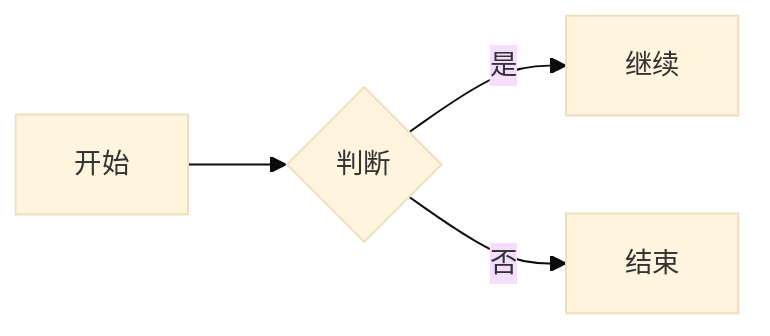

### 0.2 你在本项目里需要特别注意的点

- Mermaid 版本：前端依赖为 `mermaid@^11.12.2`（不同版本的语法/支持的图表可能略有差异）
- `xychart-beta`（折线/柱状图）：
  - Mermaid 解析器对 `x-axis [...]` / `line [...]` / `bar [...]` 的数组**不允许在 `[]` 内换行**，否则会报 `got 'NEWLINE'`
  - 本项目的渲染组件已做兼容：如果你把数组写成多行，会在渲染前自动合并为单行再解析
- 缩进：Mermaid 对缩进不总是严格，但**建议统一使用两个空格**（尤其是 `sequenceDiagram`、`gantt`、`journey` 这种层级更明显的图）
- 中文与特殊字符：
  - 一般中文可直接写；涉及引号、冒号等结构化语法时，按该图表语法要求加引号
  - `flowchart` 里节点文本使用 `A[文本]`、`B{判断}` 时，文本里尽量不要再出现 `[` `]`；必须出现时建议改用全角 `【】`
- 初始化配置（可选）：用 `%%{init: ... }%%` 可以设主题、字体、颜色等（不同渲染器对 theme 处理可能不同，本项目会走 Mermaid 的标准初始化）

---

## 1) 折线图 / 柱状图（xychart-beta）

### 1.1 适用场景

- 折线：趋势/变化（例如月活增长）
- 柱状：对比/分布（例如季度营收）

### 1.2 格式（常用指令）

- `xychart-beta`：图类型（beta）
- `title "..."`：图内标题
- `x-axis [a, b, c]`：X 轴标签数组（**数组不要在 `[]` 里换行**）
- `y-axis "名称" min --> max`：Y 轴名称与范围
- `line [v1, v2, v3]`：折线数据（与 x 轴标签数量一致）
- `bar [v1, v2, v3]`：柱状数据（与 x 轴标签数量一致）

### 1.3 注意事项

- `x-axis` 标签建议用**短字符串**（如 `2024-01`、`Q1`），避免过长导致横向拥挤
- 数据数量要一致：`x-axis` 的个数应与 `line/bar` 的个数一致
- 如果需要多条折线：Mermaid 的 `xychart-beta` 支持能力随版本变化较大；本项目优先按单条线/单组柱写法来保证稳定

### 1.4 Demo：折线图（line）

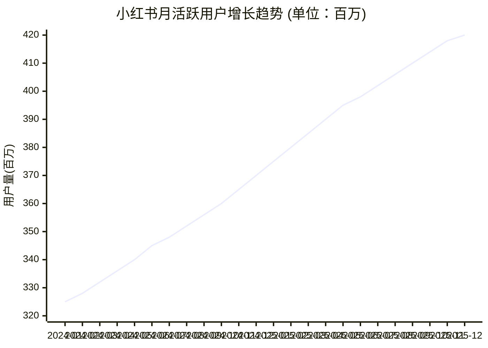

### 1.5 Demo：柱状图（bar）

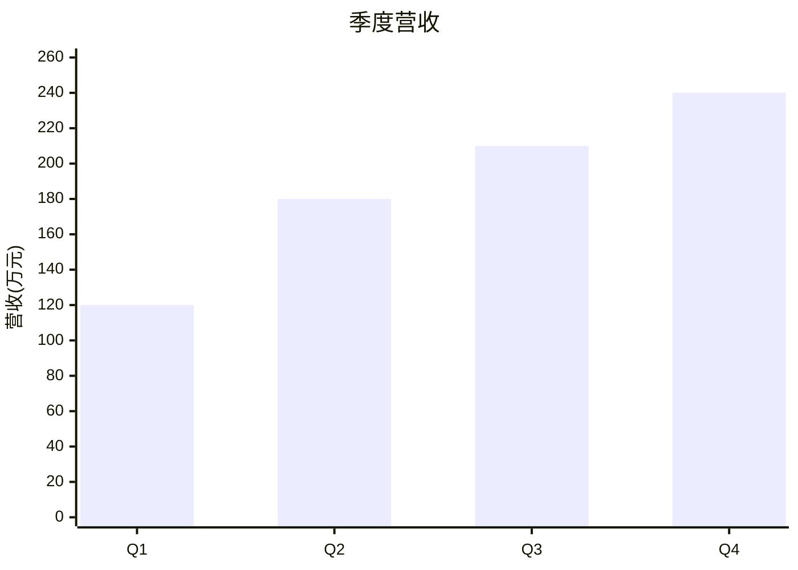

---

## 2) 饼图（pie）

### 2.1 适用场景

- 占比/构成（预算、来源占比、分类占比）

### 2.2 格式

- `pie title 标题`：饼图 + 标题
- 每行 `"标签" : 数值`：注意冒号左右的空格更直观

### 2.3 注意事项

- 类目不要太多（建议 3–7 个），否则标签会拥挤
- 标签建议用引号包起来，避免出现空格、冒号等导致解析歧义

### 2.4 Demo

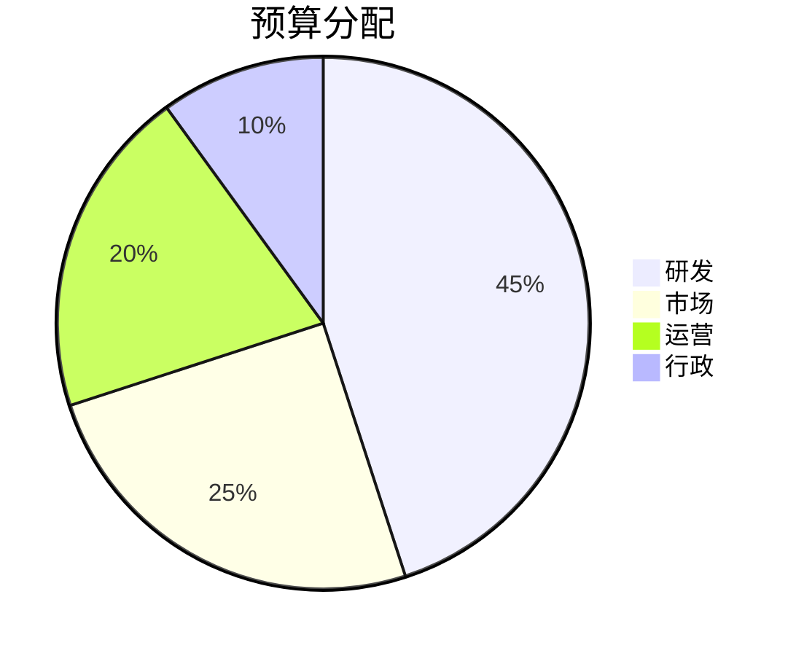

---

## 3) 甘特图（gantt）

### 3.1 适用场景

- 项目计划、里程碑排期、任务依赖

### 3.2 格式（最常用）

- `gantt`：图类型
- `dateFormat YYYY-MM-DD`：日期格式（非常关键）
- `section 名称`：分组
- `任务名 :id, start, duration` 或 `任务名 :id, after otherId, duration`：任务定义

### 3.3 注意事项

- 时间解析依赖 `dateFormat`，写错会导致整体错位或无法渲染
- `after a1` 这种依赖写法，要求被依赖任务的 `id` 存在

### 3.4 Demo

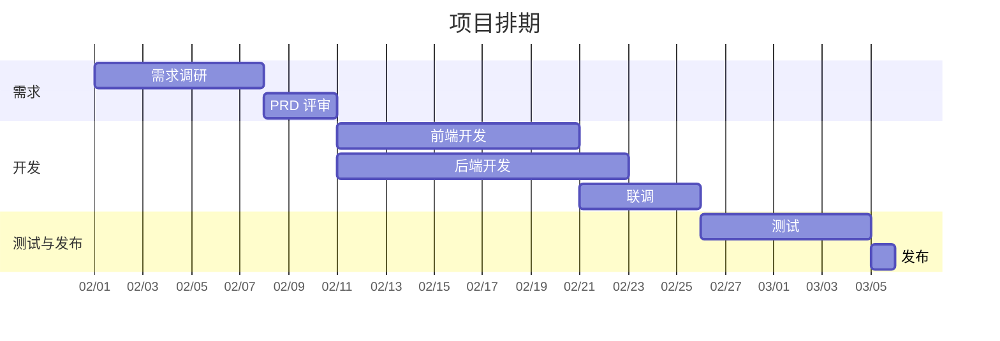

---

## 4) 流程图（flowchart）

### 4.1 适用场景

- 业务流程、决策分支、系统调用流

### 4.2 格式（最常用）

- `flowchart TD` / `LR` / `RL` / `BT`：方向（上到下、左到右等）
- `A[矩形]`、`B(圆角)`、`C{菱形判断}`：常见节点形状
- `A --> B`：有向连接；`A --- B`：无向/弱连接
- `A -- 文本 --> B`：带标签的连线

### 4.3 注意事项

- 节点 ID（如 `A`、`order_page`）建议只用字母数字下划线，显示文本写在 `[]` / `{}` 里
- 节点显示文本里尽量不要出现 `[` `]`；必须出现时建议用全角 `【】`

### 4.4 Demo：下单流程

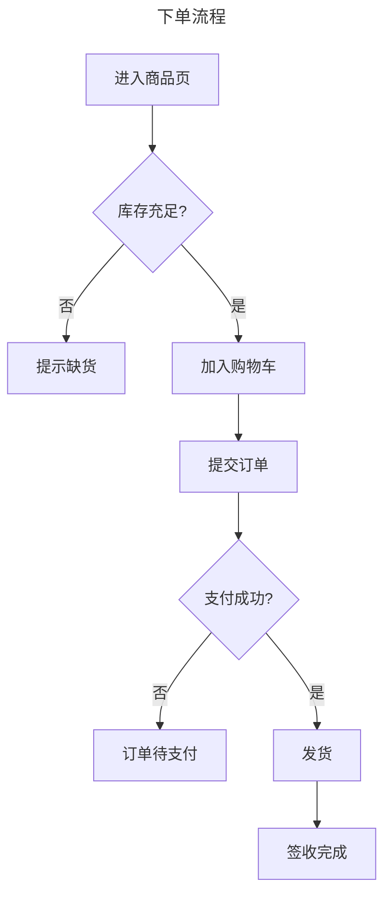

### 4.5 Demo：子图/分组（subgraph）

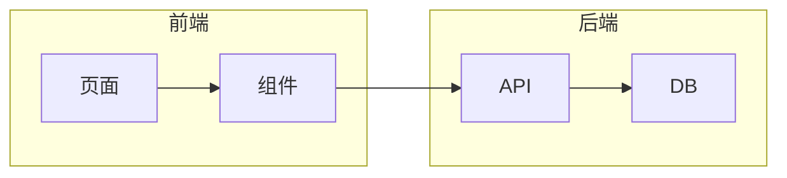

---

## 5) 时序图（sequenceDiagram）

### 5.1 适用场景

- 多参与者交互（前端/后端/DB/第三方），强调“先后顺序”

### 5.2 格式

- `sequenceDiagram`：图类型
- `actor` / `participant`：参与者定义
- `A->>B: 消息`：同步消息；`A-->>B: 返回`：返回/虚线
- `autonumber`：自动编号（可选）

### 5.3 注意事项

- 参与者名字建议用短别名：`participant A as API`
- 消息文本里包含冒号、括号等一般没问题，但建议不要写过长

### 5.4 Demo：登录流程（简化）

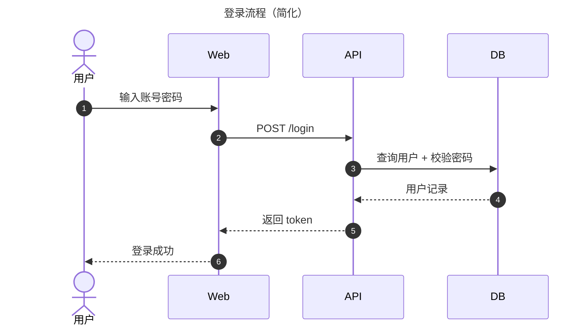

---

## 6) 类图 / 包图（classDiagram）

### 6.1 适用场景

- 类结构、接口、依赖关系；也可用 `namespace` 表达“包/模块分组”

### 6.2 格式

- `classDiagram`：图类型
- `class ClassName { ... }`：类定义
- `A --> B`：依赖（常用）
- `namespace xxx { ... }`：分组（常用于包/模块表达）

### 6.3 注意事项

- 类成员的可见性符号（如 `+` `-`）按习惯使用即可，不是必须
- “包图”在 Mermaid 里不是独立图类型时，优先用 `namespace` 或者用 `flowchart` 画依赖

### 6.4 Demo：包/模块结构

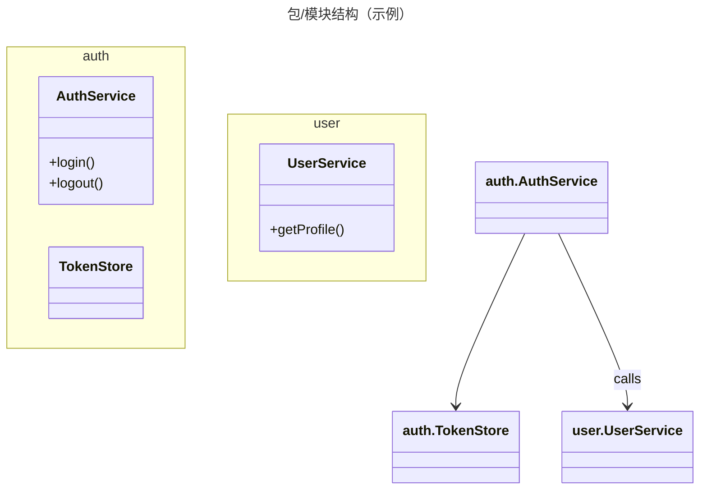

---

## 7) 状态图（stateDiagram-v2）

### 7.1 适用场景

- 状态机：订单、审批、任务流转等

### 7.2 格式

- `stateDiagram-v2`：图类型
- `A --> B : event`：状态迁移（可带触发条件/事件）
- `[*]`：起始/终止

### 7.3 注意事项

- 状态名建议用简单英文/驼峰（`PendingPay`），显示含义可放在事件或另行说明

### 7.4 Demo：订单状态机

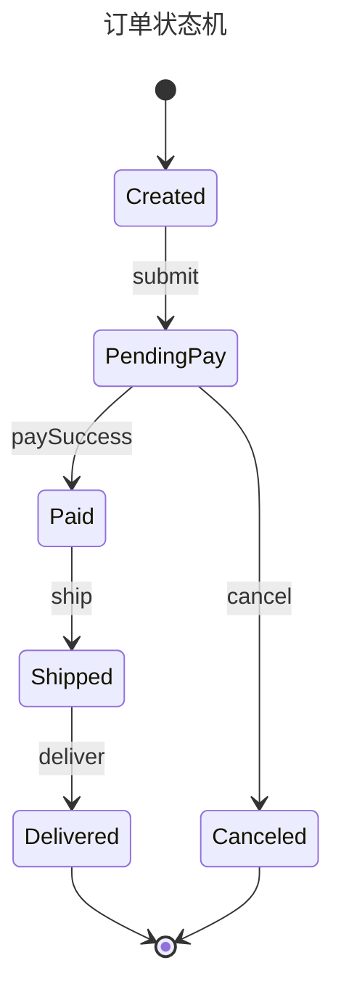

---

## 8) 实体关系图（erDiagram）

### 8.1 适用场景

- 数据库表关系、领域实体关系（1:1 / 1:N / N:N）

### 8.2 格式

- `erDiagram`：图类型
- 关系：`A ||--o{ B : label`（含义可理解为 A “一” 对 B “多”）
- 字段：在实体块里写 `type name`

### 8.3 注意事项

- 字段类型是展示用途，不会校验成数据库真实类型
- 关系符号较多，实际使用时先记住最常用的 1:N / N:N 即可

### 8.4 Demo：博客数据模型

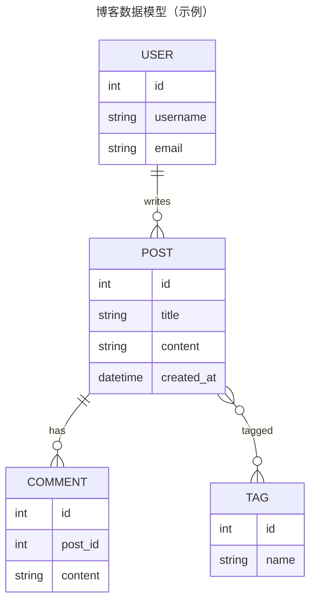

---

## 9) 思维导图（mindmap）

### 9.1 适用场景

- 头脑风暴、知识结构、计划拆解

### 9.2 格式

- `mindmap`：图类型
- 通过缩进表示层级（根节点通常写 `root((...))`）

### 9.3 注意事项

- 层级不要太深（建议 ≤ 5），否则阅读会很拥挤
- 节点文字建议短一些，长说明放到正文

### 9.4 Demo：学习路线

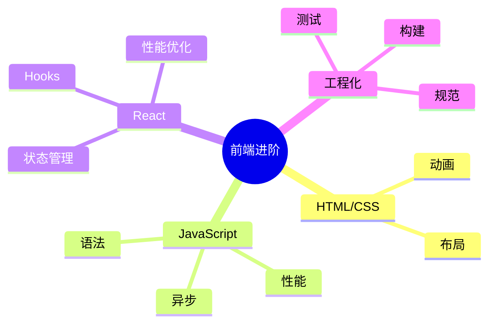

---

## 10) 四象限图（quadrantChart）

### 10.1 适用场景

- 优先级矩阵、战略分析（价值/成本、影响/难度等）

### 10.2 格式

- `quadrantChart`：图类型
- `x-axis 左 --> 右`、`y-axis 下 --> 上`：坐标轴
- `quadrant-1/2/3/4 名称`：四象限命名
- `"点名": [x, y]`：点坐标（0–1 之间）

### 10.3 注意事项

- 坐标是 0–1 的归一化值；无需纠结单位，关键是相对位置
- 点名建议用引号包裹，避免空格导致解析歧义

### 10.4 Demo：功能优先级四象限

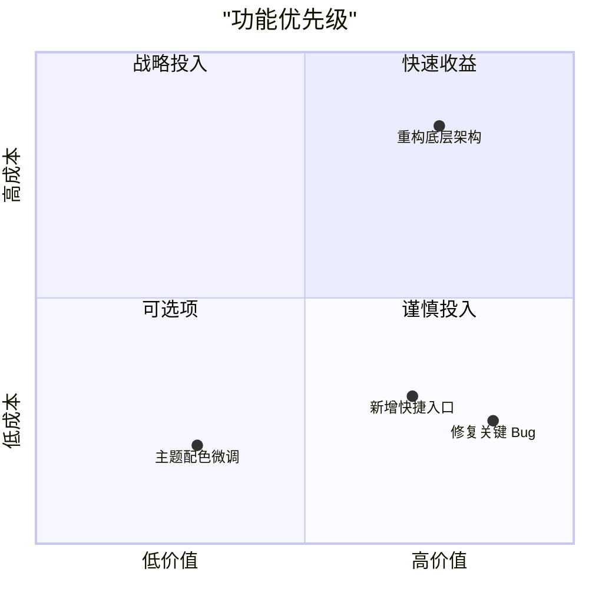

---

## 11) 时间线图（timeline）

### 11.1 适用场景

- 里程碑、版本迭代、事件回顾

### 11.2 格式

- `timeline`：图类型
- `title ...`：标题
- `时间点 : 事件 : 细节`：同一时间点可以写多段

### 11.3 注意事项

- 时间点可以是年、季度、日期等（取决于你的表达习惯）
- 文本不要太长，长内容建议拆成多条

### 11.4 Demo：产品里程碑

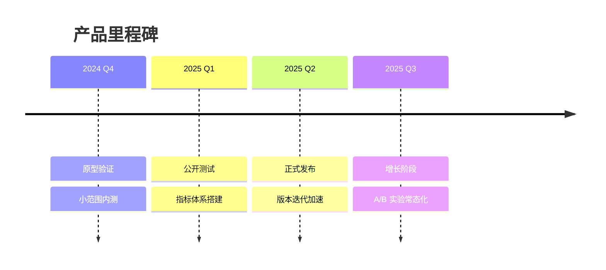

---

## 12) 需求图（requirementDiagram）

### 12.1 适用场景

- 需求层级拆解、验证方式标注（测试/演示/分析等）

### 12.2 格式

- `requirementDiagram`：图类型
- `requirement / functionalRequirement / performanceRequirement`：需求类型（常见几种）
- `id:`、`text:`、`risk:`、`verifyMethod:`：常用字段
- `A - contains -> B`：层级包含关系

### 12.3 注意事项

- 字段值建议用英文/短词（如 `risk: high`），可读性更好
- 如果渲染器版本较老可能不支持该图类型（本项目使用较新版本，通常可用）

### 12.4 Demo：需求拆分

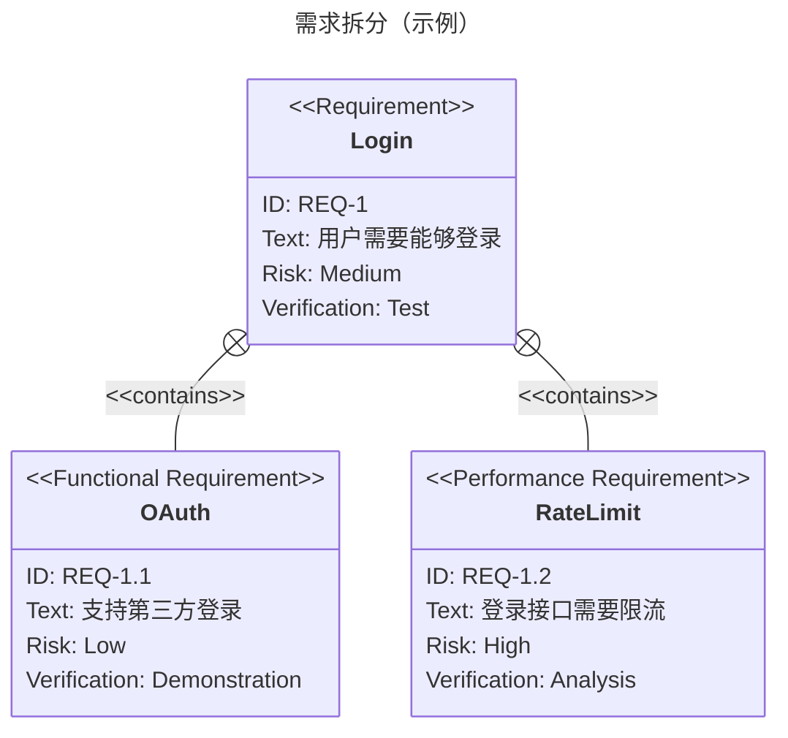

---

## 13) 用户旅程图（journey）

### 13.1 适用场景

- 用户体验评估、痛点分析、服务设计

### 13.2 格式

- `journey`：图类型
- `title ...`：标题
- `section ...`：阶段
- `事件: 分数: 参与者`：例如 `注册: 2: 用户`（分数通常 1–5）

### 13.3 注意事项

- 分数最好保持同一量表（比如 1–5），便于横向对比
- 阶段不要太多（建议 3–6 个），每阶段事件 2–5 个更好读

### 13.4 Demo：新用户上手旅程

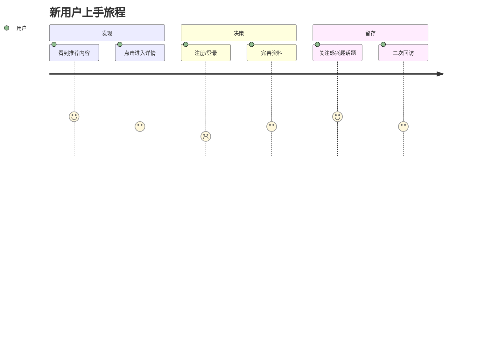
